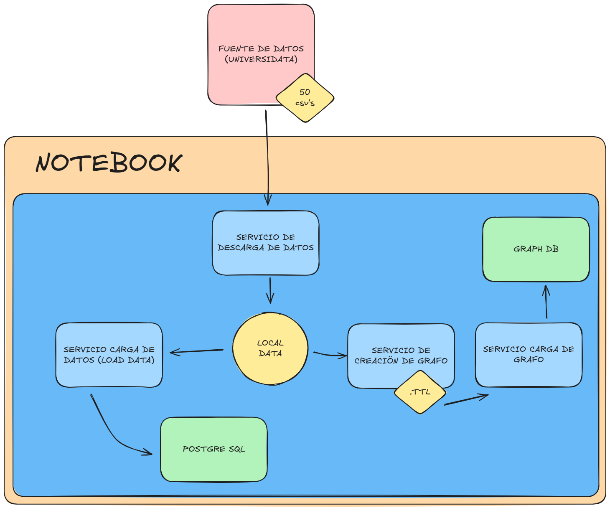

# Hackathon GBD - Sistema de Gestión de Datos UAM

Proyecto de hackathon para gestión de datos de la Universidad Autónoma de Madrid utilizando PostgreSQL, pgVector y GraphDB.

**Documentación**:

- [Arquitectura del Sistema (ARCHITECTURE)](ARCHITECTURE.md) - Diagramas y flujo de datos

## Inicio Rápido

Para iniciar el pipeline completo, simplemente ejecutar:

```
docker compose up -d
```

### Diagrama del pipeline



### Configuración Inicial

1. **Clonar el repositorio**

```bash
git clone <repo-url>
cd hackathon_gbd
```

2. **Configurar variables de entorno**

```bash
# El archivo .env ya está configurado con valores por defecto
# Editar si es necesario
nano .env
```

3. **Iniciar todos los servicios**

```bash
# Crear la red Docker
docker network create gestbd_net

# Iniciar servicios
docker compose up -d
```

### Orden de Ejecución de Servicios

Los servicios se ejecutan en el siguiente orden automáticamente:

1. **db** (PostgreSQL) - Base de datos principal
2. **descarga_datos** - Descarga archivos CSV de datos abiertos UAM
3. **load_data** - Carga los CSV en PostgreSQL
4. **create_graph** - Genera grafo RDF/TTL desde los CSVs
5. **upload_to_graphdb** - Sube el grafo TTL a GraphDB automáticamente
6. **pgadmin** - Interfaz web para PostgreSQL
7. **graphdb** - Base de datos de grafos

### Verificar el Estado

```bash
# Ver estado de todos los servicios
docker compose ps

# Ver logs del servicio de carga de datos
docker compose logs -f load_data

# Ver logs de todos los servicios
docker compose logs -f
```

## Servicios

### PostgreSQL (db)

- Puerto: `5432`
- Usuario: `myuser`
- Password: `mypassword`
- Base de datos: `mydb`

### pgAdmin

- URL: http://localhost:8080
- Email: `admin@example.com`
- Password: `admin`

### GraphDB

- URL: http://localhost:8000

### Descarga de Datos (descarga_datos)

Descarga automáticamente todos los CSV de datos abiertos de la UAM desde 2017 hasta 2025.

### Carga de Datos (load_data)

**Carga automática de datos a PostgreSQL con:**

- Auto-descubrimiento de archivos CSV
- Normalización de códigos de universidad ("23" → "023")
- Validación de claves foráneas
- Deduplicación de licitaciones
- Estadísticas detalladas por archivo

Ver documentación completa en [load_data/README.md](load_data/README.md)

### Generación de Grafo RDF (create_graph)

**Genera grafo RDF/TTL desde los CSVs con:**

- Ontología personalizada (G2_ONT)
- Metadatos DCAT (datasets y distribuciones)
- Enlaces a recursos externos (DBpedia, Wikidata)
- Relaciones entre entidades (universidades, licitaciones, ayudas, presupuestos)
- Auto-descubrimiento de todos los CSVs

**Archivo generado:**

- `data/ttl/grafo_completo.ttl` - Grafo RDF completo listo para GraphDB

Ver documentación completa en [create_graph/README.md](create_graph/README.md)

### Upload a GraphDB (upload_to_graphdb)

**Sube automáticamente el grafo TTL a GraphDB:**

- Espera a que GraphDB esté disponible
- Crea repositorio `uam_data` (si no existe)
- Sube el archivo TTL completo
- Muestra estadísticas (número de triples)
- Proceso completamente automatizado

Ver documentación completa en [upload_to_graphdb/README.md](upload_to_graphdb/README.md)

## Estructura de Datos

### Tablas en PostgreSQL

1. **UNIVERSIDAD** - Información de universidades
2. **PRESUPUESTO_GASTOS** - Gastos por año y concepto (~115K registros)
3. **PRESUPUESTO_INGRESOS** - Ingresos por año y concepto (~18K registros)
4. **CONVOCATORIA_AYUDA** - Convocatorias de ayudas
5. **AYUDA** - Ayudas concedidas (~10K registros)
6. **LICITACION** - Licitaciones y contratos mayores

### Datos Cargados (2017-2025)

- **14 archivos** de presupuestos de gastos
- **14 archivos** de presupuestos de ingresos
- **7 archivos** de convocatorias de ayudas
- **7 archivos** de ayudas
- **8 archivos** de licitaciones

---

## VISUALIZACION DE RESULTADOS

Ejecutar jupyter notebook [demo/presentacion.ipynb](demo/presentacion.ipynb)
